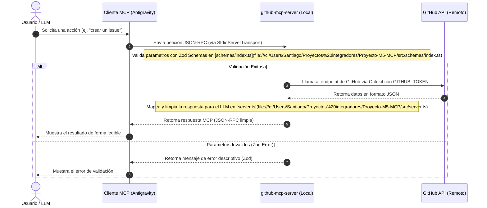
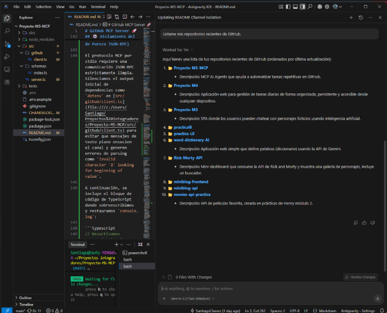
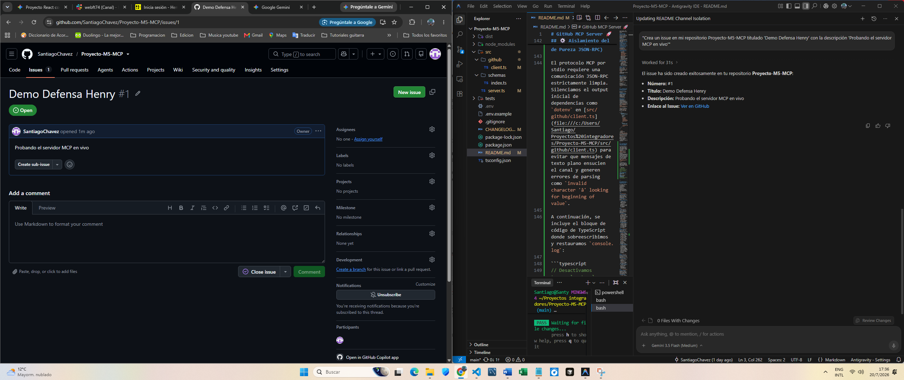

# GitHub MCP Server 🚀


Este proyecto es un servidor basado en el **Model Context Protocol (MCP)** de Anthropic, integrado con la API de GitHub mediante **Octokit** y TypeScript. Permite que modelos de inteligencia artificial interactúen directamente con repositorios de GitHub (listar repositorios, crear repositorios, listar y crear issues, y realizar commits).

---

## 📐 Diagrama de Arquitectura

El siguiente diagrama detalla cómo fluye una solicitud de forma segura e interactiva desde el cliente MCP (como **Antigravity**) hasta la API de GitHub y de regreso:



---

## 📋 Características y Capacidades

- **Servidor MCP Completo:** Implementado en [server.ts](file:///c:/Users/Santiago/Proyectos%20integradores/Proyecto-M5-MCP/src/server.ts) utilizando el SDK oficial `@modelcontextprotocol/sdk`.
- **Validación Robustas (Zod):** Todos los parámetros de entrada se validan estrictamente mediante los esquemas en [schemas/index.ts](file:///c:/Users/Santiago/Proyectos%20integradores/Proyecto-M5-MCP/src/schemas/index.ts).
- **Manejo de Errores Amigable:** Los errores HTTP (401, 404, 403, 422) devueltos por GitHub se capturan y transforman en descripciones legibles para el LLM.
- **Pruebas Completas:** Suite de pruebas en [github.test.ts](file:///c:/Users/Santiago/Proyectos%20integradores/Proyecto-M5-MCP/tests/github.test.ts) configurada con `vitest` que cubre Happy Paths y Casos Borde críticos.

---

## 📂 Estructura del Proyecto

```text
Proyecto-M5-MCP/
├── dist/                  # Código compilado a JavaScript (generado tras build)
├── src/
│   ├── github/
│   │   └── client.ts      # Inicialización y validación del cliente Octokit
│   ├── schemas/
│   │   └── index.ts       # Esquemas de validación de herramientas con Zod
│   └── server.ts          # Inicialización del servidor MCP y registro de tools
├── tests/
│   └── github.test.ts     # Pruebas unitarias e integración con Vitest (mocked)
├── package.json           # Scripts de compilación, ejecución y dependencias
├── tsconfig.json          # Configuración del compilador de TypeScript
└── .env.example           # Plantilla de variables de entorno
```

---

## 🛠️ Requisitos Previos

1. [Node.js](https://nodejs.org/) (Versión 18 o superior instalada).
2. [Git](https://git-scm.com/) instalado en el sistema.

---

## 🚀 Instalación y Configuración Paso a Paso

### 1. Clonar e Instalar dependencias
Abre tu terminal y ejecuta los siguientes comandos:
```bash
git clone <url-del-repositorio>
cd Proyecto-M5-MCP
npm install
```

### 2. Obtener y configurar el Token de GitHub
El servidor requiere un token de acceso personal (Personal Access Token - PAT) para comunicarse con GitHub.

#### Pasos para generar el Token:
1. Ve a tu cuenta de GitHub y haz clic en tu foto de perfil (esquina superior derecha) -> **Settings**.
2. En el menú de la izquierda, desplázate hasta abajo y selecciona **Developer settings**.
3. Elige **Personal access tokens** -> **Tokens (classic)**.
4. Haz clic en **Generate new token** -> **Generate new token (classic)**.
5. Asigna una descripción (ej. `mcp-github-server`).
6. **Configura los Scopes necesarios:**
   - **`repo`** (Completo: `repo:status`, `repo_deployment`, `public_repo`, `repo:invite`, `security_events`): Requerido para listar/crear repositorios, listar/crear issues y realizar commits.
7. Haz clic en **Generate token** al final de la página.
8. > [!IMPORTANT]
   > Copia el token de inmediato. No podrás volver a verlo después de salir de la página.

#### Configurar el archivo `.env`:
Crea un archivo `.env` en la raíz del proyecto basándote en la plantilla `.env.example`:
```env
GITHUB_TOKEN=tu_token_generado_aqui
```

#### Variables de Envío / Entorno:

| Variable | Tipo | Requerido | Descripción |
| :--- | :--- | :--- | :--- |
| `GITHUB_TOKEN` | String | Sí | Personal Access Token (Classic) con permisos `repo` para interactuar con la API. |
| `NODE_ENV` | String | No | Entorno de ejecución (`development` / `production`). |

### 3. Compilar el proyecto
Antes de agregar el servidor a cualquier cliente MCP, debes compilar el código TypeScript a JavaScript ejecutable:
```bash
npm run build
```
Esto generará los archivos correspondientes dentro del directorio `./dist`.

---

## 💻 Integración del Servidor en Clientes MCP (Antigravity)

Para que un cliente MCP como **Antigravity** o **Claude Desktop** pueda utilizar el servidor, debes agregarlo a la configuración correspondiente.

### Archivo de Configuración
Generalmente, la configuración se realiza agregando el servidor al archivo de configuración de MCP (como `config.json` de la extensión MCP de tu IDE, o `%APPDATA%/Claude/claude_desktop_config.json` en Windows).

Inserta la siguiente configuración en la sección `mcpServers` de tu archivo JSON:

```json
{
  "mcpServers": {
    "github-mcp-server": {
      "command": "node",
      "args": [
        "c:/Users/Santiago/Proyectos integradores/Proyecto-M5-MCP/dist/server.js"
      ],
      "env": {
        "GITHUB_TOKEN": "TU_GITHUB_TOKEN_AQUI"
      }
    }
  }
}
```

> [!NOTE]
> Asegúrate de sustituir `TU_GITHUB_TOKEN_AQUI` por tu token real y de verificar que la ruta absoluta al archivo `dist/server.js` sea la correcta en tu disco local. En Windows, utiliza barras diagonales (`/`) para evitar problemas de escape de caracteres.

---

## ⚙️ Aislamiento del Canal Stdio (Garantía de Pureza JSON-RPC)

El protocolo MCP por stdio requiere una comunicación JSON-RPC estrictamente limpia. Silenciamos el output inicial de dependencias como `dotenv` en [src/github/client.ts](file:///c:/Users/Santiago/Proyectos%20integradores/Proyecto-M5-MCP/src/github/client.ts) para evitar que mensajes de texto plano ensucien el canal y generen errores de parsing como `invalid character 'â' looking for beginning of value`.

A continuación, se incluye el bloque de código de TypeScript donde sobreescribimos y restauramos `console.log`:

```typescript
// Desactivamos temporalmente el console.log para que dotenv no imprima mensajes gráficos en stdio
const originalLog = console.log;
console.log = () => { };
dotenv.config();
console.log = originalLog; // Restablecemos console.log normalmente
```

---

## 📖 Referencia de Herramientas (Tools) y Prompts Efectivos

El servidor registra las siguientes herramientas. A continuación se detallan sus parámetros, descripciones y ejemplos de prompts para interactuar de forma efectiva con el LLM:

### 1. `list-repositories`
* **Descripción:** Lista los primeros 50 repositorios del usuario autenticado ordenados por última actualización.
* **Parámetros:** Ninguno (objeto vacío `{}`).
* **Prompt Efectivo:**
  > "Muestra mis repositorios de GitHub recientes"
  > "Lista mis repositorios guardados en GitHub para ver en cuáles he trabajado últimamente"

### 2. `create-repository`
* **Descripción:** Crea un repositorio público nuevo en la cuenta del usuario autenticado.
* **Parámetros:**
  * `name` (String, requerido): Nombre del repositorio. Debe tener entre 3 y 100 caracteres. Solo letras, números, puntos, guiones y guiones bajos.
  * `description` (String, opcional): Breve descripción del repositorio.
* **Prompt Efectivo:**
  > "Crea un nuevo repositorio público en GitHub llamado 'mi-proyecto-mcp' con la descripción 'Un servidor MCP para pruebas'"

### 3. `create-issue`
* **Descripción:** Crea un nuevo issue abierto en un repositorio específico.
* **Parámetros:**
  * `owner` (String, requerido): Usuario u organización dueña del repositorio.
  * `repo` (String, requerido): Nombre del repositorio.
  * `title` (String, requerido): Título del issue (máximo 256 caracteres).
  * `body` (String, opcional): Descripción detallada del problema o tarea.
* **Prompt Efectivo:**
  > "Crea un issue en el repositorio 'SantiagoChavez/Proyecto-M5-MCP' titulado 'Corregir enlaces del README' y con la descripción 'Debemos asegurarnos de que todos los enlaces del README funcionen localmente'"

### 4. `list-issues`
* **Descripción:** Obtiene una lista de los issues con estado abierto de un repositorio específico.
* **Parámetros:**
  * `owner` (String, requerido): Propietario del repositorio.
  * `repo` (String, requerido): Nombre del repositorio.
* **Prompt Efectivo:**
  > "Muestra cuáles son los issues abiertos en el repositorio 'SantiagoChavez/Proyecto-M5-MCP'"

### 5. `create-commit`
* **Descripción:** Realiza un commit agregando un archivo nuevo o modificando uno existente en una rama específica.
* **Parámetros:**
  * `owner` (String, requerido): Propietario del repositorio.
  * `repo` (String, requerido): Nombre del repositorio.
  * `path` (String, requerido): Ruta del archivo (ej. `src/index.js` o `README.md`).
  * `message` (String, requerido): Mensaje explicativo del commit.
  * `content` (String, requerido): Contenido en texto plano que se escribirá en el archivo.
  * `branch` (String, opcional): Nombre de la rama. Por defecto es `main`.
* **Prompt Efectivo:**
  > "Crea un commit en el repositorio 'SantiagoChavez/Proyecto-M5-MCP' en la rama 'main' que cree o modifique el archivo 'docs/info.txt' con el contenido 'Esta es información de prueba del servidor MCP' y el mensaje de commit 'docs: agregar info.txt'"

---

## 📸 Pruebas de Funcionamiento en Vivo

A continuación se presentan las evidencias de ejecución en tiempo real del servidor MCP integrado con el agente de IA en el IDE:

### 1. Consulta de Lectura (`list-repositories`)
El LLM interpreta la intención del usuario en lenguaje natural (*'Listame mis repositorios recientes de GitHub'*) e invoca de manera autónoma la herramienta `list-repositories`, obteniendo la lista real de proyectos desde la API de GitHub:



---

### 2. Ejecución de Escritura (`create-issue`)
El agente ejecuta la herramienta `create-issue` previa autorización de seguridad, creando el Issue **#1 ("Demo Defensa Henry")** en el repositorio. En la imagen se observa la respuesta del agente a la derecha y el issue en estado *Open* en la interfaz de GitHub a la izquierda:



---

## 🧪 Verificación y Pruebas

Para garantizar que el servidor funciona correctamente, puedes ejecutar los siguientes procesos de verificación:

### Pruebas Unitarias
El proyecto cuenta con una suite completa de pruebas unitarias usando `vitest` que verifica el comportamiento de los esquemas Zod y simula llamadas a la API de GitHub para verificar el manejo de errores (401, 403, 404, 422).
Ejecuta las pruebas con:
```bash
npm run test
```

### Ejecutar Localmente en Desarrollo
Puedes verificar el arranque del servidor en tiempo real y comprobar que se conecte correctamente al flujo `stdio`:
```bash
npm run dev
```
**Salida esperada en consola (stderr):**
```text
[INFO] Conectando el servidor MCP de GitHub a través de stdio... 
[SUCCESS] Servidor MCP de GitHub corriendo y conectado.
```

---

## 🔍 Resolución de Problemas (Troubleshooting)

Aquí tienes una lista de los errores más comunes y cómo solucionarlos:

| Error / Síntoma | Causa Común | Solución |
| :--- | :--- | :--- |
| **calling "initialize": invalid character 'â' looking for beginning of value** | Salida de consola no estructurada (logs de dotenv o console.log directos) ensuciando el canal de comunicación stdio antes de la handshake JSON-RPC. | Silenciar cualquier output en stdout durante la carga inicial de variables de entorno en [src/github/client.ts](file:///c:/Users/Santiago/Proyectos%20integradores/Proyecto-M5-MCP/src/github/client.ts) y no incluir console.log planos al arrancar el servidor. |
| **Error 401 (Unauthorized)** | El `GITHUB_TOKEN` es incorrecto, ha expirado o no está configurado en el archivo `.env` o la configuración del cliente. | Genera un nuevo token classic clásico en GitHub con el scope `repo`, actualiza tu archivo `.env` o reinicia el cliente MCP para que recargue las variables de entorno. |
| **Error 404 (Not Found)** | El repositorio especificado no existe, el nombre del propietario (`owner`) o repositorio (`repo`) tiene un error de ortografía, o el token no tiene permisos para acceder a repositorios privados. | Verifica detalladamente la ortografía del dueño y repositorio. Si el repositorio es privado, asegúrate de que tu Token de GitHub tenga los permisos necesarios en repositorios privados. |
| **Error 403 (Rate Limit Exceeded)** | Se ha superado el límite de llamadas a la API de GitHub permitido por tu token. | Espera a que se reinicie el límite (generalmente una hora) o genera un token nuevo en una cuenta diferente si es para desarrollo activo. |
| **Error 422 (Validation Failed)** | Estás intentando crear un repositorio con un nombre que ya existe en tu cuenta de GitHub. | Ejecuta la acción utilizando un nombre diferente y que esté libre. |
| **El servidor no inicia en Antigravity / Claude Desktop** | La ruta al archivo `dist/server.js` en tu archivo de configuración JSON es incorrecta o contiene espacios sin escapar adecuadamente. | En sistemas Windows, escribe las rutas con barras diagonales `/` (ej. `c:/Ruta/Al/Proyecto/dist/server.js`) y asegúrate de haber ejecutado `npm run build` para generar el directorio `dist`. |

---

> [!NOTE]
> **Registro de Prueba:** Este documento fue modificado de forma remota y su commit fue realizado de manera autónoma utilizando la herramienta `create-commit` del propio servidor MCP desarrollado en este proyecto.